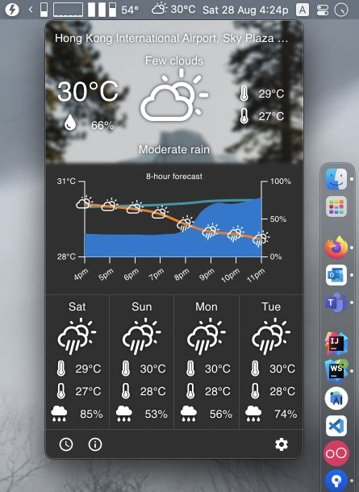
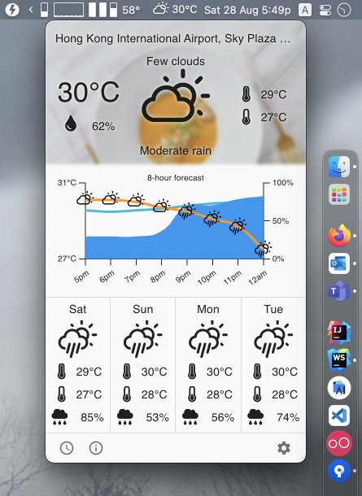

# Day Day Weather Forecast

[](https://github.com/ayltai/DayDayWeatherForecast/actions)
[](https://sonarcloud.io/dashboard?id=ayltai_DayDayWeatherForecast)
[](https://sonarcloud.io/dashboard?id=ayltai_DayDayWeatherForecast)
[](https://sonarcloud.io/dashboard?id=ayltai_DayDayWeatherForecast)
[](https://sonarcloud.io/dashboard?id=ayltai_DayDayWeatherForecast)
[](https://sonarcloud.io/dashboard?id=ayltai_DayDayWeatherForecast)
[](https://sonarcloud.io/dashboard?id=ayltai_DayDayWeatherForecast)
[](https://sonarcloud.io/dashboard?id=ayltai_DayDayWeatherForecast)
[](https://sonarcloud.io/dashboard?id=ayltai_DayDayWeatherForecast)


[](https://github.com/ayltai/DayDayWeatherForecast/releases)
[](https://github.com/ayltai/DayDayWeatherForecast/blob/master/LICENSE)

A gorgeous weather app for macOS.

## Features
* Beautiful and easy to use weather app
* Supports [multiple](#weather-providers) weather providers
* Provides only the information that matters - temperature, humidity, precipitation, wind speed and UV index
* Hourly and daily forecast
* Auto refresh data and background image
* Supports metric and imperial units
* ... and more. Check out the screenshots below!

## Weather providers
* [AccuWeather](https://www.accuweather.com)
* [OpenWeatherMap](https://openweathermap.org)

## Screenshots

### Dark mode


### Light mode


## Development

### Requirements
1. Install [NodeJS](https://nodejs.org)
2. Install dependencies
   ```shell
   npm i
   ```

### Configurations

#### AccuWeather API
1. Specify an endpoint to access AccuWeather API. This could be the official endpoint `https://dataservice.accuweather.com` or an API proxy such as [passthrough-proxy-accuweather](https://github.com/ayltai/passthrough-proxy-accuweather).
   ```shell
   export REACT_APP_API_ENDPOINT_ACCUWEATHER=https://dataservice.accuweather.com
   ```
2. Get an API key from [AccuWeather](https://developer.accuweather.com)
3. Specify the API key for using AccuWeather:
   ```shell
   export REACT_APP_API_KEY_ACCUWEATHER=XXXXX
   ```

#### OpenWeatherMap API
1. Specify an endpoint to access OpenWeatherMap API. This could be the official endpoint `https://api.openweathermap.org` or an API proxy such as [passthrough-proxy-openweathermap](https://github.com/ayltai/passthrough-proxy-openweathermap).
   ```shell
   export REACT_APP_API_ENDPOINT_OPENWEATHERMAP=https://api.openweathermap.org
   ```
2. Get an API key from [OpenWeatherMap](https://openweathermap.org/api)
3. Specify the API key for using OpenWeatherMap:
   ```shell
   export REACT_APP_API_KEY_OPENWEATHERMAP=XXXXX
   ```

#### HERE API
1. Specify an endpoint to access HERE API. This could be the official endpoint `https://[service].search.hereapi.com` or an API proxy such as [passthrough-proxy-here](https://github.com/ayltai/passthrough-proxy-here).
   ```shell
   export REACT_APP_API_ENDPOINT_HERE=https://[service].search.hereapi.com
   ```
2. Get an API key from [HERE](https://developer.here.com)
3. Specify the API key for using HERE:
   ```shell
   export REACT_APP_API_KEY_HERE=XXXXX
   ```

#### Unsplash API
1. Specify an endpoint to access Unsplash API. This could be the official endpoint `https://api.unsplash.com` or an API proxy such as [passthrough-proxy-unsplash](https://github.com/ayltai/passthrough-proxy-unsplash).
   ```shell
   export REACT_APP_API_ENDPOINT_UNSPLASH=https://api.unsplash.com
   ```
2. Get an API key from [Unsplash](https://unsplash.com/developers)
3. Specify the API key for using Unsplash:
   ```shell
   export REACT_APP_API_KEY_UNSPLASH=XXXXX
   ```

### Run
```shell
npm run electron
```

### Build
```shell
npm run build
```

### Package
```shell
npm run package
```

## License
This project is licensed under the terms of the [MIT license](https://github.com/ayltai/DayDayWeatherForecast/blob/LICENSE).
